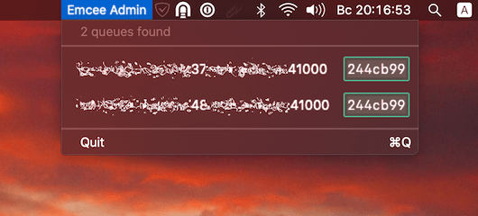
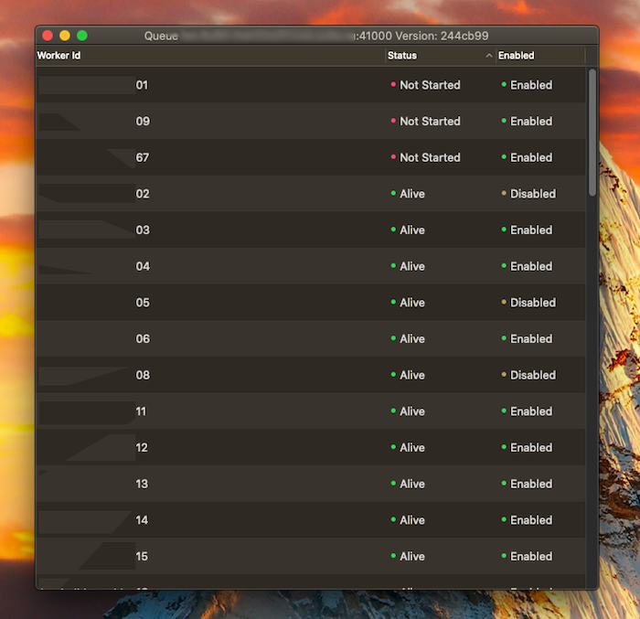

# Emcee Admin

Emcee Admin app allows to track and manage Emcee queue instances.

Current functionality:

- Discover running queues addresses and their versions
- Track worker statuses
- Enable and disable workers

## Building and Running

```shell
$ make app
```

Finder will present you a folder containing `EmceeAdmin.app`. You can launch it from there or move to `/Applications` folder to launch any time e.g. using **Spotlight**.

## Adding Hosts to Query

There is no Preferences window yet. Invoke this to add hosts:

```shell
$ defaults write ru.avito.emceeadmin "hosts" '(host1.com, host2.com)'
```

## Screenshots

Menu bar shows all running queues:



When you select a queue from a menu bar, worker management window will be present:



Select workers and right-click to enable/disable them. 
